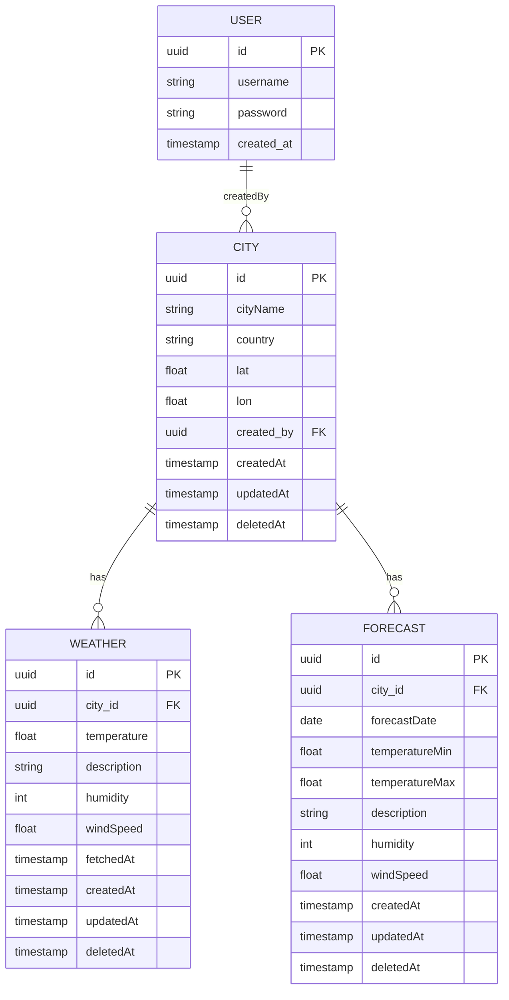

<!-- docker compose down --volumes --remove-orphans -->

# 🌦️ Weather API (Node.js + TypeORM + TypeScript + Express)

A modular, class-based REST API built with TypeScript, Express, TypeORM, PostgreSQL, JWT authentication, and Swagger documentation — deployable with Docker and Docker Compose.

---

## Table of Contents

- [Weather API (Node.js + TypeORM + TypeScript + Express)](#weather-api-nodejs--typescript--express)
- [🚀 Features](#-features)
- [📁 Project Structure](#-project-structure)
- [✅ Requirements](#-requirements)
- [🔧 Installation](#-installation)
- [🔄 Available Scripts](#-available-scripts)
- [🔮 Swagger Docs](#-swagger-docs)
- [🌐 Docker Usage](#-docker-usage)
- [🌟 Deployment Notes](#-deployment-notes)
- [🛢️ Dabase Design](#-database-design)
- [👨‍💻 Author](#-author)

---

## 🚀 Features

- 🔐 JWT-based authentication (login/register)
- 🌤️ Weather module with external API integration
- ✅ Input validation using `class-validator` and `Joi`
- 🧩 Swagger (OpenAPI 3.0) for API docs
- 🛡️ Global error handling and DTO validation
- 📦 Modular architecture (services, controllers, routes)
- 🌱 TypeORM with PostgreSQL + migration support
- 🧠 Uses `tsconfig-paths` for clean import aliases
- ☁️ Docker-ready for deployment

---

## 📁 Project Structure
```
src/
├── db/ # entities, migrations, subscribers
├── modules/ # feature modules (user, weather, etc.)
├── middlewares/ # error, auth, validation, etc.
├── routes/ # central route exports
├── utils/ # JWT, helpers, Swagger, validation config, etc.
├── index.ts # Express app setup and app entry point
├── config.ts # Enviroment Setup
└── init-services.ts # Initializing Start up Services
```

---

## 🧩 Requirements

- Node.js: `v20.16.0`
- npm: `v10.9.2`
- PostgreSQL: `v13+`
- Redis
- `.env` file with the following:

```env
HOST=localhost
PORT=8010
NODE_ENV=development

REDIS_URL=redis://default:@localhost:6379

DB_HOST=localhost
DB_PORT=5432
DB_USER=your_user
DB_PASS=your_password
DB_NAME=your_db

JWT_SECRET=your_jwt_secret
OPENWEATHER_API_KEY=your_openweather_api_key
```

## 🔧 Installation

Development
```bash
# Clone the project
git clone https://github.com/your-username/weather-api.git
cd weather-api

# Install dependencies
npm install

# Start in development mode
npm run dev
```

Production
```bash
# Clone the project
git clone https://github.com/your-username/weather-api.git
cd weather-api

# Install dependencies
npm install

# Build File
npm run build

# Start The Server (Env In Production Must Be Provided OS Level Based On Node ENV)
npm run start
```

🔨 Available Scripts
| Command                                 | Description                      |
| --------------------------------------- | -------------------------------- |
| `npm run dev`                           | Run in dev mode with hot reload  |
| `npm run build`                         | Compile TypeScript + fix aliases |
| `npm run start`                         | Run compiled app from `dist/`    |
| `npm run migration:generate src/db/migrations/${migrationName}` | Generate new migration           |
| `npm run migration:run`                 | Run pending migrations           |


## 🔮 Swagger Docs
- Accessible at: http://localhost:8010/api-docs
- Uses swagger-jsdoc + swagger-ui-express


## 🌐 Docker Usage
Make sure Docker and Docker Compose are installed. (And Also Update Docker Compose Enviroment Value (Api Keys) Accordingly)

```bash
# Start everything
docker-compose up --build

# Alternative For Newer Versions
docker compose up --build

```
If You Notice Two Instances Running Use The Command Below, The Try The Command Above
```bash
# Stop and clean
docker-compose down --volumes --remove-orphans

# Alternative For Newer Versions
docker compose down --volumes --remove-orphans
```
### Included Services
- app - Your Express + TypeScript server
- db - PostgreSQL 15
- redis - Redis 7

The app will be available at: http://localhost:8010
Swagger UI: http://localhost:8010/api-docs

## 🌟 Deployment Notes

You Must Have Postgres UUID extention Enabled

```sql
CREATE EXTENSION IF NOT EXISTS "uuid-ossp";
```

## 🛢️ Dabase Design



🧙‍♂️ Author
Built and maintained by [MhKh]
